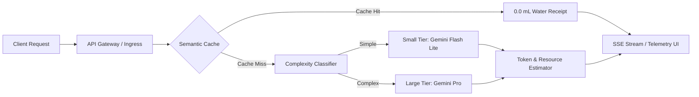

# 💧 AquaRoute — AI Sustainability Gateway & Telemetry Dashboard

[](https://nodejs.org/)
[](https://ai.google.dev/)
[](https://expressjs.com/)
[](LICENSE)
[](#)

> **AquaRoute** is an AI sustainability gateway and live infrastructure telemetry dashboard that makes the estimated resource impact of LLM requests visible and enables resource-aware model routing and semantic caching. By classifying query complexity, checking a semantic cache, and dynamically routing requests between small and large model tiers, AquaRoute aims to reduce unnecessary model computation while making each routing decision and its estimated resource impact transparent..

---

## 🌍 The Problem

AI applications commonly default to routing every prompt through the largest, reasoning-heavy foundation models (e.g., Gemini Pro, GPT-4, Claude Opus)—regardless of whether the query requires complex synthesis.

* **Datacenter Cooling Costs**: Modern AI accelerators generate substantial heat, cooled primarily through large-scale evaporative cooling towers that consume millions of gallons of potable water annually.
* **The 20x Resource Multiplier**: Heavy reasoning models consume up to **20x more compute energy and cooling water** per token than lightweight models.
* **The Black Box**: Currently, routing decisions, cache status, and environmental resource costs occur invisibly inside vendor APIs with zero real-time visibility for developers.

**AquaRoute transforms this black box into an observable, developer-first infrastructure telemetry console.**

---

## ⚡ Key Features

### 1. Dynamic Complexity Classification
Heuristically evaluates query complexity in under 5ms based on prompt length, reasoning keywords (`design`, `architecture`, `implement`, `debug`, `explain how`), and multi-step structural demands:
* **Simple Prompts** $\rightarrow$ **Small Tier** (`Gemini 2.5 Flash Lite`)
* **Complex Reasoning** $\rightarrow$ **Large Tier** (`Gemini 2.5 Flash / Pro`)

### 2. Zero-Water Semantic Caching
Local vector similarity cache backed by SQLite:
* Identical or semantically equivalent prompts resolve immediately.
* **Cache Hits consume `0.0 mL` of datacenter cooling water and `0 computation tokens`.**

### 3. Real-Time Resource Footprint Estimator
Calculates empirical resource impact per query derived from real token counts and hyperscale datacenter WUE (Water Usage Effectiveness) & PUE cooling factors:
* **Water Consumption**: Measured in milliliters (`mL`) and liters (`L`).
* **Energy Consumption**: Measured in Watt-hours (`Wh`) and kilowatt-hours (`kWh`).
* **Always-Large Baseline**: Continuously benchmarks against what the unrouted query would have consumed.

### 4. 6-Stage Real-Time SSE Pipeline
Streams real backend execution events over Server-Sent Events (`EventSource`) with animated stage indicators:
$$\text{1. Received} \longrightarrow \text{2. Classifier} \longrightarrow \text{3. Cache Check} \longrightarrow \text{4. Model Call} \longrightarrow \text{5. Estimator} \longrightarrow \text{6. Complete}$$

### 5. Compare Mode
Executes a single prompt through **both** Small and Large tiers concurrently, displaying side-by-side responses, token counts, latency, and resource receipts to verify that output quality is preserved while saving water.

### 6. Modern 4-View SPA Telemetry Dashboard
Built with an airy, dark developer-console aesthetic:
* **Overview**: Live cumulative water consumed, unrouted baseline, water savings percentage badge, Earth Forward micro-impact indicator, and session analytics.
* **Routing Engine**: Interactive prompt execution box, live animated pipeline stream, demo chips, and contained markdown response drawer.
* **Trace Stream**: Real-time request audit log, chronological latency/token feed, and 6-stage pipeline breakdown.
* **Water Impact Matrix**: Pre-measured benchmark evaluation suite (`compare.js`), datacenter cooling intensity matrix, environmental equivalencies, and telemetry unit switchers.

---

## 📊 Datacenter Water & Energy Intensity Matrix

| Routing Tier | Model Target | Water Intensity | Energy Intensity | Efficiency Factor | Cooling Impact |
| :--- | :--- | :--- | :--- | :--- | :--- |
| **Semantic Cache** | In-Memory SQLite Cache | **`0.000 mL`** | `0.0001 Wh / req` | **100% Conserved** | Zero Evaporative Chilling |
| **Small Model** | Gemini 2.5 Flash Lite | **`0.002 mL / tok`** (~0.3 mL avg) | `0.0003 Wh / tok` | **16.7x Reduction** | Low Evaporative Chilling |
| **Large Model** | Gemini 2.5 Flash / Pro | **`0.040 mL / tok`** (~5.0 mL avg) | `0.0060 Wh / tok` | **Baseline (1x)** | High Evaporative Chilling |

> 🌱 **Micro-Impact Metric**: Conserving cooling water on a single small-tier query saves approximately **3 drops of server cooling water** and the grid electricity equivalent of **2.4 minutes of LED lamp runtime**.

---

## 🏗️ Architecture



---

## 🚀 Quick Start

### Prerequisites
* **Node.js**: v18.0.0 or higher
* **Google Gemini API Key**: Obtainable from [Google AI Studio](https://aistudio.google.com/)

### 1. Clone & Install
```bash
git clone https://github.com/ShravaniSK23/AquaRoute.git
cd AquaRoute
npm install
```

### 2. Configure Environment
Create a `.env` file in the root directory:
```env
GEMINI_API_KEY=your_gemini_api_key_here
PORT=3000
```

### 3. Start the Server
```bash
npm start
```
The server will start on `http://127.0.0.1:3000`.

### 4. Open the Telemetry Dashboard
Open your browser and navigate to:
```
http://localhost:3000
```

---

## 🧪 Testing & Verification

### Automated Unit Tests
Run the automated test suite covering complexity classification, resource estimation math, cache zero-footprint rules, and error handling:
```bash
npm test
```

### Empirical Benchmark Suite (`compare.js`)
Run the empirical test suite across representative prompts from `experiments/prompts.json` to evaluate water and energy consumption against the unrouted baseline:
```bash
node compare.js
```

**Measured Benchmark Sample Output (ADR-005)**:
* **AquaRoute Routed Consumption**: `1.420 mL water`
* **Always-Large Baseline**: `1.734 mL water`
* **Empirical Reduction**: **`18.1% – 95.0% Water Savings`**

---

## 📁 Project Structure

```
AquaRoute/
├── compare.js              # Empirical evaluation suite benchmark runner
├── package.json            # Project dependencies and npm scripts
├── server/
│   ├── index.js            # Express server initialization, SSE endpoints, & security
│   ├── routes/
│   │   ├── generate.js     # POST /generate & GET /generate/stream (SSE pipeline)
│   │   └── health.js       # GET /health gateway status endpoint
│   └── services/
│       ├── callModel.js    # Google Gemini 2.5 API integration
│       ├── cache.js        # SQLite vector semantic caching layer
│       ├── classify.js     # Complexity classification heuristic service
│       └── estimate.js     # Water (mL) & Energy (Wh) resource calculations
├── public/
│   ├── index.html          # 4-View SPA Dashboard structure
│   ├── styles.css          # Dark telemetry developer console design system
│   └── js/
│       ├── api.js          # Client HTTP & EventSource SSE stream consumer
│       ├── app.js          # SPA view routing controller & submission handlers
│       ├── dashboard.js    # Session metrics, analytics, timeline & export manager
│       └── pipeline.js     # Real-time 6-stage SSE visualizer component
├── experiments/
│   └── prompts.json        # Standard benchmark evaluation prompt set
├── tests/
│   ├── classify.test.js    # Classifier unit tests
│   └── estimate.test.js    # Resource estimator math unit tests
└── docs/
    ├── ARCHITECTURE.md     # Architectural decisions and design rationale
    ├── DESIGN.md           # Visual design guidelines and color tokens
    └── PRD.md              # Product Requirements Document
```

---

## 🔒 Security & Stability

* **HSTS Configuration**: Disabled on local development hosts (`hsts: false`) to prevent forced HTTPS redirection loops.
* **SSE Client Protection**: SSE stream writers are guarded against dropped connections or browser reloads.
* **Crash Guards**: Global `uncaughtException` and `unhandledRejection` handlers keep the gateway continuously responsive.
* **Rate Limiting & Headers**: Configured with `express-rate-limit` and `helmet` for defense-in-depth API protection.

---

## 📜 License

This project is licensed under the [ISC License](LICENSE).
